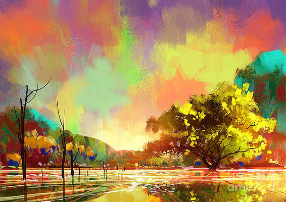

This repository comprises the submission for the Generative AI assignment at Dashtoon. The provided Jupyter Notebook file contains the code for implementing Artistic Style Transfer on images.

Additionally, within the "images" folder, you will find a collection of target images where the style transfer will be applied. This folder also includes images representing various famous artworks, serving as style references.

The model was trained on Kaggle with a GPU T4 x2, leveraging the computational power for efficient processing. In case any required library is missing, you can install it using the 'pip install' command.

### Artistic Style Transfer Images

Target Image

Style reference Image

Generated Image

